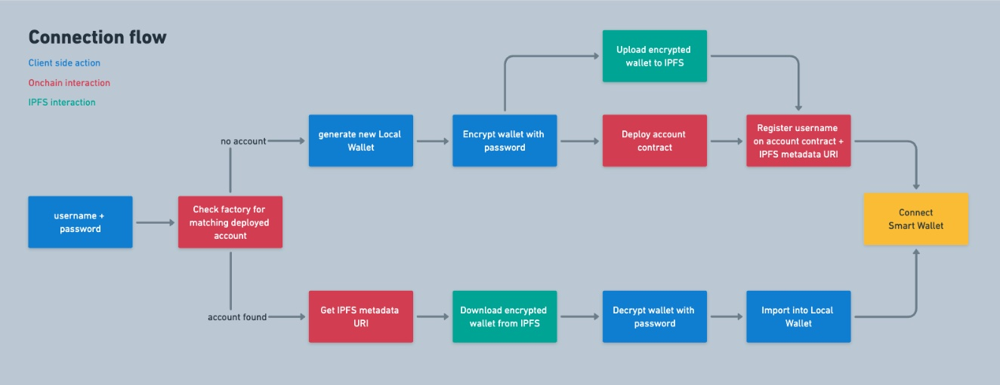

# Log in to Ethereum with username / password

This is a ERC-4337 experiment that shows how to connect to a smart account using only a username and password.

Only requires a bundler/paymaster for user operations and an IPFS gateway. Can be used with the provider of your choice, from any device, on any domain. No walled gardens or centralized infrastructure.

Solves most of the UX issues:

- Accessible from any platform - web, native apps, etc
- No domain restrictions, can be used on any domain
- Syncs to any device, all data lives onchain and on IPFS
- No pop up or mobile app redirects, all signatures happen under the hood
- Every account comes with a easy to remember username

## Live Demo

[https://ethlogin.thirdweb-preview.com/](https://ethlogin.thirdweb-preview.com/)

## How it works

- Account factory acts as a registry for usernames
- Private keys are generated client side, encrypted and stored on IPFS
- Account contract stores the IPFS hash of the encrypted private key + metadata like the username



## What about recovery?

This demo is a simplified version of what could be achieved. Next steps would be:

- Use EIP-7579 modular accounts
- Add a recovery module to the account by default

A good recovery module option would be a [zk-email account recovery module](https://github.com/zkemail/email-recovery?tab=readme-ov-file#universalemailrecoverymodulesol), letting you "reset" the smart account admin to a new EOA, and update the IPFS data attached to the account.

## What about security?

Reminder, this is a demo, don't use it as is in production!

To make this account safe to use, one idea would be to encode policies in the account (via a 7579 module) which would effectively add a 2FA layer to the account on certain conditions.

Some ideas:

- enforce having a secondary signer available once account balances are above a threshold
- enforce a maximum spend limit when only one signer is available
- enforce 2 or more signatures (one could be a zkemail proof) for high value transactions and approvals

This would allow you to make the account quite safe, while still keeping the UX benefits of no pop up or mobile app redirects when executing low value transactions.

## What about multi chain?

This demo is on a single chain, but it could be extended to multiple chains by moving the username registry from the account factory to a keystore rollup.

Instead of storing the account metadata on the account contract, it would be stored in the keystore rollup. Apps could look up the username in the keystore, get the data and decrypt the private key to connect to the smart account on any chain.

Important to keep the factory addresses deterministic so the addresses are identical on every chain.

Usernames could also come from the ENS registry on namechain, instead of living in the same registry as the keys.

## Run the app locally

This app uses thirdweb default RPC, bundler and IPFS services. Get a client id from [thirdweb](https://thirdweb.com/) and set it in a `.env.local` file.

```bash
NEXT_PUBLIC_THIRDWEB_CLIENT_ID=your-client-id
```

You can also configure the SDK to use your own RPC, bundler and/or IPFS gateway.

Run the app:

```bash
pnpm dev
```
